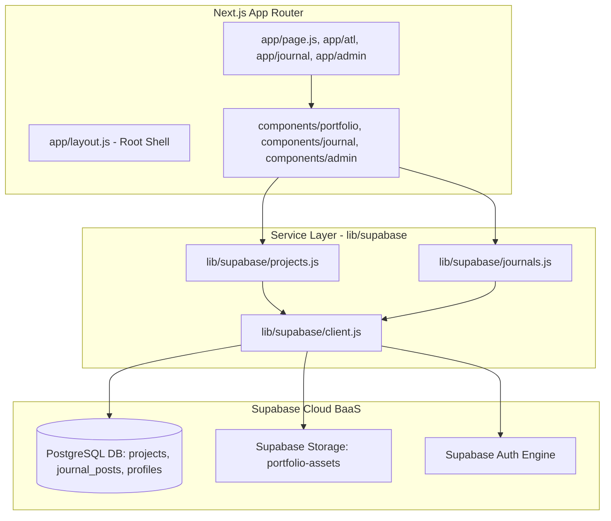

# 🏗️ Architecture & System Design Blueprint

**Framework:** Next.js 16 (App Router) + React 19  
**Backend & Database:** Supabase Serverless BaaS (PostgreSQL + Storage + Auth)  

---

## 📐 1. System Architecture Diagram



---

## 📂 2. Directory Architecture & Layering

```
PortfolioWebsite/
 ├── app/                         <-- Presentation Layer (App Router)
 │   ├── layout.js                <-- Global Site Wrapper & Fonts
 │   ├── page.js                  <-- Home Portfolio (/ )
 │   ├── atl/page.js              <-- Commercial Portfolio (/atl)
 │   ├── fine-arts/page.js        <-- Fine Arts Gallery (/fine-arts)
 │   ├── journal/page.js          <-- Journal Essays (/journal)
 │   └── admin/page.js            <-- Admin Dashboard (/admin)
 ├── components/                  <-- Modular UI Component Layer
 │   ├── admin/                   <-- Admin WYSIWYG & Form Components
 │   ├── journal/                 <-- Journal Cards & List Components
 │   ├── layout/                  <-- Navigation, Header, Footer
 │   └── portfolio/               <-- Territory Gallery, Filters, Modal
 ├── lib/                         <-- Business & API Service Layer
 │   └── supabase/
 │       ├── client.js            <-- Supabase Connection Initializer Singleton
 │       ├── projects.js          <-- Projects Data Queries & Upload Logic
 │       └── journals.js          <-- Journal Data Queries & Upload Logic
 ├── styles/                      <-- CSS Design Tokens & Stylesheets
 └── public/ & assets/            <-- Static Assets & Media
```

---

## 🔒 3. Data Flow & Security Principles

1. **Client-Side Data Fetching:** Dynamic components in `app/` invoke modular service functions in `lib/supabase/` to fetch published projects and journals directly from Supabase.
2. **Environment Variables:** All secrets and configuration keys are securely held in `.env.local` using `NEXT_PUBLIC_SUPABASE_URL` and `NEXT_PUBLIC_SUPABASE_ANON_KEY`.
3. **Decoupled Architecture:** UI components do not write raw database queries. All queries pass through reusable helper services in `lib/supabase/`.
