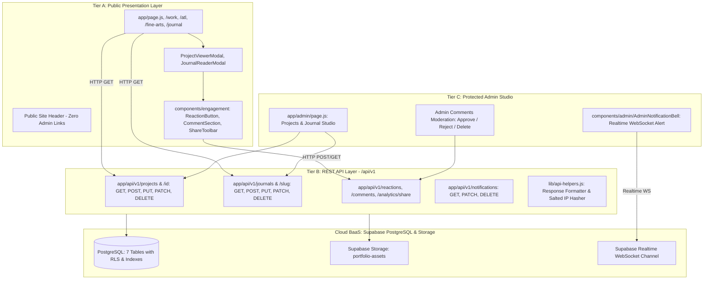

# 🏗️ Architecture & System Design Blueprint

**Framework:** Next.js 16.2.12 (Turbopack App Router) + React 19.2.8  
**Architecture Model:** Unified 3-Tier Model (Frontend + REST API Engine + Protected Admin Studio)  
**Backend & Database:** Supabase Serverless BaaS (PostgreSQL + Storage + Realtime + Auth)  

---

## 📐 1. System Architecture Diagram



---

## 📂 2. Directory Architecture & Layering

```
PortfolioWebsite/
 ├── app/                                 <-- App Router Presentation & API Layer
 │   ├── layout.js                        <-- Root Shell, Fonts, Global CSS
 │   ├── page.js                          <-- Public Home Portfolio (/ )
 │   ├── work/page.js                     <-- Public Work Archive (/work)
 │   ├── atl/page.js                      <-- Public Commercial Portfolio (/atl)
 │   ├── fine-arts/page.js                <-- Public Fine Arts Gallery (/fine-arts)
 │   ├── passion-works/page.js            <-- Public Passion Projects (/passion-works)
 │   ├── professional-works/page.js       <-- Public Campaigns (/professional-works)
 │   ├── journal/page.js                  <-- Public Journal Essays (/journal)
 │   ├── admin/page.js                    <-- Admin Studio (/admin) with Comments Moderation
 │   └── api/v1/                          <-- Standardized REST API Engine
 │       ├── projects/                    <-- Projects API (GET, POST)
 │       │   └── [id]/                    <-- Project Item API (GET, PUT, PATCH, DELETE)
 │       ├── journals/                    <-- Journals API (GET, POST)
 │       │   └── [slug]/                  <-- Journal Item API (GET, PUT, PATCH, DELETE)
 │       ├── reactions/                   <-- Reactions API (GET, POST with Rate Limiting)
 │       ├── comments/                    <-- Comments API (GET, POST with Honeypot, PATCH, DELETE)
 │       ├── analytics/                   <-- Engagement Analytics Engine
 │       │   ├── share/                   <-- Share Tracking API (GET, POST)
 │       │   └── overview/                <-- Aggregated Overview & Ranking API (GET)
 │       └── notifications/               <-- Notifications API (GET, PATCH, DELETE)
 ├── components/                          <-- Modular UI Components
 │   ├── admin/                           <-- Admin WYSIWYG & AdminNotificationBell
 │   ├── engagement/                      <-- ReactionButton, CommentSection, ShareToolbar
 │   ├── journal/                         <-- Journal Cards & JournalReaderModal
 │   ├── layout/                          <-- Navigation, Header, MobileHeader
 │   └── portfolio/                       <-- Territory Gallery, Filters, ProjectViewerModal
 ├── lib/                                 <-- Core Library & Services
 │   ├── api-helpers.js                   <-- Uniform JSON Response & Privacy-Safe IP Hasher
 │   └── supabase/                        <-- Client Singleton & Service Methods
 ├── styles/                              <-- Modular CSS System
 │   ├── base.css, layout.css             <-- Design tokens, grid, reset
 │   ├── engagement.css                   <-- Reactions, comments, share buttons styling
 │   └── admin/admin.css                  <-- Admin studio, KPI stats & analytics styles
 ├── scripts/                             <-- Database SQL Migration Scripts
 │   ├── supabase-journal-setup.sql       <-- Projects & journals tables setup
 │   └── supabase-engagement-setup.sql    <-- Reactions, comments, share_logs, notifications
 └── documentation/                       <-- Memory Brain Kit Suite
```

---

## 🔒 3. Data Flow & Security Principles

1. **Uniform JSON Responses:** All REST APIs return standardized responses (`{ success, message, data, meta, error }`) with standard HTTP status codes (`200`, `201`, `400`, `404`, `429`, `500`).
2. **Visitor Privacy & Rate-Limiting:** IP addresses are never saved in raw text. They are salted and hashed via HMAC-SHA-256 (`getClientIpHash`) to enforce a maximum of 5 reactions per visitor per 24 hours without violating privacy laws (GDPR/CCPA compliant).
3. **Multi-Layer Anti-Bot Defense:**
   - Hidden Honeypot trap (`website`) silently catches and neutralizes automated bots.
   - Cloudflare Turnstile integration readiness.
   - Default `status = 'pending'` on all guest comments ensures zero malicious links or spam appear on the live website before admin approval.
4. **Real-time Push Notifications:** Admin receives live visual alerts with unread badge counters via Supabase Realtime WebSockets whenever a visitor comments, reacts, or shares an artwork.
5. **Engagement Analytics Aggregation:** High-performance aggregation endpoint (`/api/v1/analytics/overview`) computes live reaction totals, comment states, and multi-channel share distributions for top KPI dashboard cards and per-work performance leaderboards.
6. **Decoupled Client-Side Resilience:** If any new table has not yet been migrated in Supabase, the API handlers employ graceful schema fallbacks (`Could not find the table` catch) so the public portfolio continues functioning with 100% uptime.
